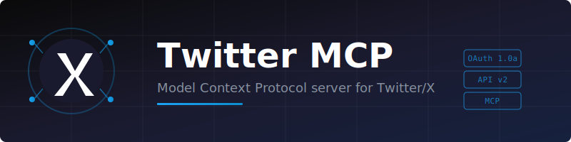

<p align="center">
  
</p>

<p align="center">
  <em>A Model Context Protocol server that lets AI assistants interact with Twitter/X.<br/>Built in Go, designed to be simple and useful.</em>
</p>

<p align="center">
  <a href="#-getting-started">Getting Started</a> •
  <a href="#-available-tools">Tools</a> •
  <a href="#-scheduling-tweets">Scheduling</a> •
  <a href="#-authentication--security">Security</a> •
  <a href="#-docker">Docker</a> •
  <a href="#-contributing">Contributing</a>
</p>

---

## 🎯 What can it do?

This MCP gives your AI assistant the ability to:

- **Read** your timeline, mentions, search tweets, and explore user profiles
- **Write** posts, threads, replies, likes, and retweets
- **Analyze** topic popularity with a heat score system (last 24 hours)
- **Explore** trending topics by location
- **Manage** bookmarks and follow/unfollow users
- **Schedule** tweets and threads for later publishing

## 🚀 Getting started

### 1. Get your Twitter API credentials

Head to the [Twitter Developer Portal](https://developer.twitter.com/en/portal/dashboard) and create an app. You'll need:

- **API Key & Secret** (for posting, liking, retweeting)
- **Access Token & Secret** (for acting on behalf of your account) — make sure permissions are set to **Read and Write**
- **Bearer Token** (for reading public data)

> ⚠️ Heads up: Twitter's free tier is very limited. For full functionality (trends, search, timeline), you'll need at least the Basic tier ($100/month).

### 2. Choose your transport mode

Twitter MCP supports two transport modes:

#### STDIO (simple, for local use)

```yaml
server:
  name: "twitter-mcp"
  version: "0.1.0"
  transport:
    type: "stdio"

twitter:
  api_key: "$TWITTER_API_KEY"
  api_key_secret: "$TWITTER_API_KEY_SECRET"
  access_token: "$TWITTER_ACCESS_TOKEN"
  access_token_secret: "$TWITTER_ACCESS_TOKEN_SECRET"
  bearer_token: "$TWITTER_BEARER_TOKEN"

# Optional: path to the scheduling queue file (default: schedule.yaml)
schedule_file: "schedule.yaml"
```

#### HTTP (production, with auth support)

```yaml
server:
  name: "twitter-mcp"
  version: "0.1.0"
  transport:
    type: "http"
    http:
      host: ":8080"

middleware:
  jwt:
    enabled: true
    validation:
      strategy: "local"
      local:
        jwks_uri: "https://your-idp.com/.well-known/jwks.json"
        cache_interval: 5m

twitter:
  api_key: "$TWITTER_API_KEY"
  # ... rest of credentials

schedule_file: "schedule.yaml"
```

See `docs/config-stdio.yaml` and `docs/config-http.yaml` for full examples.

### 3. Build and run

```bash
go mod tidy
make build
./bin/twitter-mcp -config config.yaml
```

## 🛠️ Available tools

### Reading

| Tool | What it does |
|------|--------------|
| `get_me` | Get your account info |
| `get_timeline` | Fetch your home timeline |
| `get_mentions` | See who's mentioning you |
| `search_tweets` | Search tweets (last 24h, sorted by recency) |
| `get_trends` | Get trending topics for a location |
| `get_user_profile` | Get a user's profile by username |
| `get_user_tweets` | Get a user's recent tweets |
| `get_bookmarks` | Get your bookmarked tweets |

### Writing

| Tool | What it does |
|------|--------------|
| `post_tweet` | Post a new tweet (supports replies) |
| `post_thread` | Post a thread (multiple connected tweets) |
| `delete_tweet` | Delete one of your tweets |
| `like_tweet` | Like a tweet |
| `unlike_tweet` | Remove a like |
| `retweet` | Retweet something |
| `undo_retweet` | Undo a retweet |
| `bookmark_tweet` | Bookmark a tweet |
| `remove_bookmark` | Remove a bookmark |
| `follow_user` | Follow a user |
| `unfollow_user` | Unfollow a user |

### Analysis

| Tool | What it does |
|------|--------------|
| `search_topics` | Search multiple topics at once (last 24h) |
| `get_topics_heat` | Compare topic popularity with heat scores (last 24h) |

### Scheduling

| Tool | What it does |
|------|--------------|
| `schedule_tweet` | Add a tweet or thread to the scheduling queue |
| `schedule_update` | Modify a scheduled tweet (content, date, reviewed status) |
| `schedule_delete` | Remove a scheduled tweet from the queue |
| `schedule_list` | List all scheduled tweets, optionally filtered by status |
| `schedule_get_publishable` | Get tweets ready to publish |
| `schedule_publish` | Publish a specific scheduled tweet by ID |

## 🔥 The heat score explained

When you call `get_topics_heat` with a list of topics, it returns something like:

```json
[
  {
    "topic": "kubernetes",
    "tweet_count": 20,
    "total_likes": 1250,
    "total_retweets": 340,
    "total_replies": 89,
    "avg_engagement": 86.2,
    "heat_score": 78.5
  },
  {
    "topic": "podman",
    "tweet_count": 15,
    "total_likes": 120,
    "total_retweets": 25,
    "avg_engagement": 10.7,
    "heat_score": 51.2
  }
]
```

The score (0-100) combines tweet volume and engagement. Results come sorted from hottest to coldest. Only tweets from the **last 24 hours** are considered, sorted by recency.

## 📅 Scheduling tweets

The scheduling system lets you queue tweets and threads for later publishing. Everything is stored in a local YAML file, so it survives restarts.

### How it works

1. **Add** a tweet or thread with `schedule_tweet` — set the content, date, and type
2. **Review** it with `schedule_update` (set `reviewed: true`) when you're happy with it
3. When the time comes, the AI calls `schedule_get_publishable` to check what's ready
4. The AI calls `schedule_publish` with the ID to publish it

The AI is always in the loop — nothing publishes automatically.

### Statuses

| Status | Meaning |
|--------|---------|
| `pending` | Added but not reviewed yet |
| `reviewed` | Approved, ready to publish when time arrives |
| `published` | Successfully posted |
| `failed` | Something went wrong (check `fail_reason`) |

### Example

```
AI: schedule_tweet
  type: "tweet"
  content: ["Just shipped a new feature 🚀"]
  scheduled_at: "2026-02-25T10:00:00Z"

AI: schedule_update
  id: "abc-123"
  reviewed: true

# Later...
AI: schedule_get_publishable
  min_hours_since_last: 2

AI: schedule_publish
  id: "abc-123"
```

## 🔐 Authentication & Security

When running in HTTP mode, Twitter MCP supports:

- **JWT validation** with JWKS endpoint caching
- **CEL expressions** for fine-grained access control
- **Tool policies** based on JWT claims (groups, scopes, etc.)
- **OAuth 2.0 metadata endpoints** (RFC 9728 compliant)
- **Access logging** with header redaction

### Tool Policies

Restrict tool access based on JWT claims:

```yaml
policies:
  tools:
    # Admins can do everything
    - expression: 'payload.groups.exists(g, g == "admins")'
      allowed_tools: ["*"]
    
    # Writers can post and read
    - expression: 'payload.groups.exists(g, g == "writers")'
      allowed_tools: ["post_*", "get_*", "like_*", "retweet", "schedule_*"]
    
    # Readers can only read
    - expression: 'payload.scope.contains("twitter:read")'
      allowed_tools: ["get_*", "search_*"]
```

Supported patterns:
- Exact match: `"post_tweet"`
- Wildcard: `"*"` (all tools)
- Prefix: `"get_*"` (all tools starting with `get_`)

## 🐳 Docker

### Build and run

```bash
docker build -t twitter-mcp .
docker run -v $(pwd)/config.yaml:/config/config.yaml twitter-mcp
```

### Docker Compose

```bash
# Set environment variables
export TWITTER_API_KEY=your_key
export TWITTER_API_KEY_SECRET=your_secret
# ... etc

# Run
docker-compose up -d
```

## 🌍 Location codes for trends

The `get_trends` tool uses WOEIDs (Where On Earth IDs):

| Location | WOEID |
|----------|-------|
| 🌍 Worldwide | 1 |
| 🇪🇸 Spain | 23424950 |
| 🇺🇸 United States | 23424977 |
| 🇬🇧 United Kingdom | 23424975 |
| Madrid | 766273 |
| Barcelona | 753692 |
| New York | 2459115 |

## 🔧 Troubleshooting

### Rate limit exceeded
Twitter API has strict rate limits. Wait a few minutes and try again, or reduce request frequency.

### Could not authenticate you
Check your OAuth credentials. For posting, you need OAuth 1.0a tokens with **Read and Write** permissions. If you changed permissions after generating tokens, regenerate them from the Developer Portal.

### CreditsDepleted
You've run out of API credits. Check your Twitter Developer Portal to top up or wait for the monthly reset.

### Tool access denied
If policies are configured and you get "Access denied", ensure your JWT contains the required claims (groups, scopes) that match a policy.

### Scheduled tweet not appearing in get_publishable
Check that: (1) the tweet has `reviewed: true`, (2) `scheduled_at` is in the past, (3) enough time has passed since the last published tweet (`min_hours_since_last`).

## 🤝 Contributing

Contributions are welcome! See [CONTRIBUTING.md](CONTRIBUTING.md) for guidelines.

For AI agents working on this codebase, see [AGENTS.md](.agents/AGENTS.md).

## 📄 License

Apache 2.0
